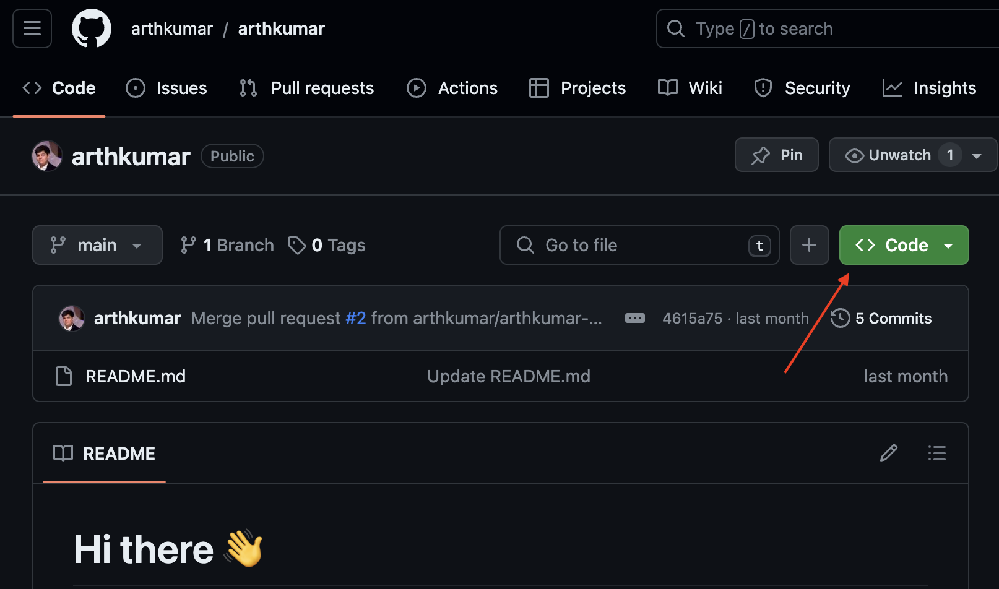
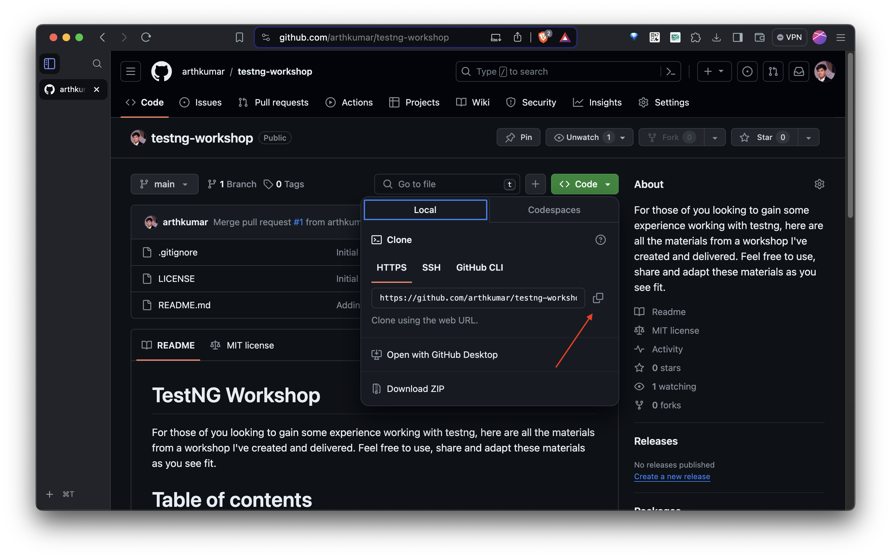

# Module 1: Introduction to TestNG

# Table of contents

- [Understanding the need for TestNG in automation](#understanding-the-need-for-testng-in-automation)
    - [Background](#background)
    - [Features of TestNG](#features-of-testng)
    - [Comparison of TestNG v/s JUnit](#comparison-of-testng-vs-junit)
- [Installing and setting up TestNG in IntelliJ](#installing-and-setting-up-testng-in-intellij)
    - [Pre-requisite](#pre-requisite)
    - [SDKMAN Installation](#sdkman-installation)
    - [JDK Installation](#jdk-installation)
    - [Maven Installation](#maven-installation)
    - [Install IntelliJ IDEA Community Edition](#install-intellij-idea-community-edition)
    - [Setting up the project in IntelliJ IDEA](#setting-up-the-project-in-intellij-idea)

## Understanding the need for TestNG in automation.

### Background

TestNG is a Java-based test automation framework that was inspired by JUnit. It overcomes all the limitations of JUnit
along with additional functionalities. This makes it more powerful and easier to use. NG here stands for “Next
Generation”.

It is designed to cover a range of test categories such as Unit testing, Functional testing, Integration testing, etc.
It is extremely popular and helps testers organize the test cases in a structured way. This helps in maintaining the
readability of the scripts.

### Features of TestNG

- It’s an open-source testing framework. It contains open APIs which are publicly available to the developers.
- It uses more Java features.
- It supports multiple Before and After test annotations.
- It supports XML-based test configurations.
- It supports the parameterization of test methods.
- It supports multi-threading testing. It supports execution in parallel.
- It allows users to perform data-based testing.
- It allows for report generation using HTML and XML reports.

### Comparison of TestNG v/s JUnit

| Criteria	         | JUnit                                                                                                                                              | TestNG                                                                                      |
|-------------------|----------------------------------------------------------------------------------------------------------------------------------------------------|---------------------------------------------------------------------------------------------|
| Supported Testing | 	Unit Testing	                                                                                                                                     | Unit Testing, Functional Testing, Integration Testing, end-to-end Testing, etc.             |
| Annotations       | 	Do not support advanced annotation like @BeforeGroups, @AfterGroups	                                                                              | Supports advanced and unique annotations like @BeforeGroups, @AfterGroups                   |
| Test Suite	       | Uses @RunWith, @Suite to run the test suite	                                                                                                       | Uses an XML file to run the test suite                                                      |
| Dependency Tests	 | Missing Dependency tests	                                                                                                                          | Supports Dependency Tests  using attributes like dependsOnMethods, dependsOnGroups          |
| Grouping Tests	   | Does not provide Grouping of test cases together                                                                                                   | 	Allows Grouping and executing of test cases together using groups attributes               |
| Order of Tests	   | Does not support	                                                                                                                                  | Supports ordering of test methods via a priority attribute                                  | 
| Custom Name	      | Provides provision for Custom descriptive names for tests                                                                                          | 	Provide Custom names with describe attribute                                               | 
| Reporting	        | Integrates with Maven to generate HTML reports	                                                                                                    | Has built-in HTML reports                                                                   | 
| Listeners	        | Supports listeners through Listeners API	                                                                                                          | Supports listeners through annotations                                                      |
| Ease of use       | 	Running tests requires a certain amount of dependency                                      Eg. for parameterization, one might need JUnit Jupiter | Writing and running tests is very easy and all dependencies come pre-built with the library |

## Installing and setting up TestNG in IntelliJ.

### Pre-requisite

- JDK 11 or higher.
- Maven 3.6.3 or higher.
- Git setup should be present.

### SDKMAN Installation

Installing SDKMAN! effortlessly sets up JDK and Maven on macOS, Linux and Windows (with WSL). Plus, it's compatible with
both Bash and ZSH shells.
> **Note**: For windows you either need Git Bash or WSL installed in order to run following commands.

- Launch a new terminal and type in:
  ```bash 
    curl -s "https://get.sdkman.io" | bash 
  ```
- Follow the on-screen instructions to wrap up the installation. Afterward, open a new terminal or run the following in
  the same shell:
  ```bash 
     source "HOME/.sdkman/bin/sdkman-init.sh"
  ```
- Lastly, run the following snippet to confirm the installation's success:
  ```bash 
     sdk version
  ```
- You should see output containing the latest script and native versions:
  ```bash
    SDKMAN!
    script: 5.18.2
    native: 0.4.6
  ```

### JDK Installation

- Install JDK 11
  ```bash
    sdk install java 11.0.22-amzn
  ```

### Maven Installation

- Install Maven
  ```bash
     sdk install maven
  ```

### Install IntelliJ IDEA Community Edition

- Download the installer from the [Toolbox App web page](https://www.jetbrains.com/toolbox/app/).
- Run the installer and follow the wizard steps.
- Click its tools tab, after you run the Toolbox App.

  
- Click on install button for IntelliJ IDEA Community Edition, by navigating to the Available dropdown.

  

### Setting up the project in IntelliJ IDEA

- Navigate to the [repo](https://github.com/arthkumar/testng-workshop)
- Click on the code button.

  
- Click on the copy to clipboard icon.

  
- Open IntelliJ IDEA Community Edition and Navigate to Project

  
- Click on get from vcs button.

  
- Enter the copied git url.

  
- Click on clone.

  
- Click on trust.

  